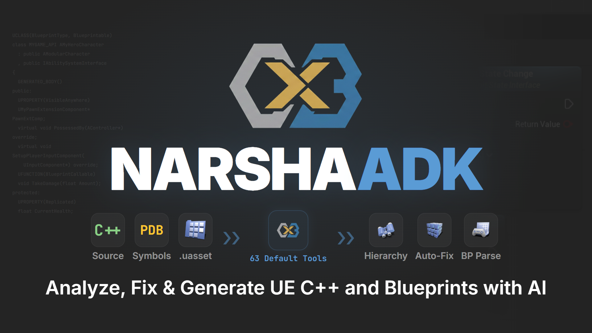
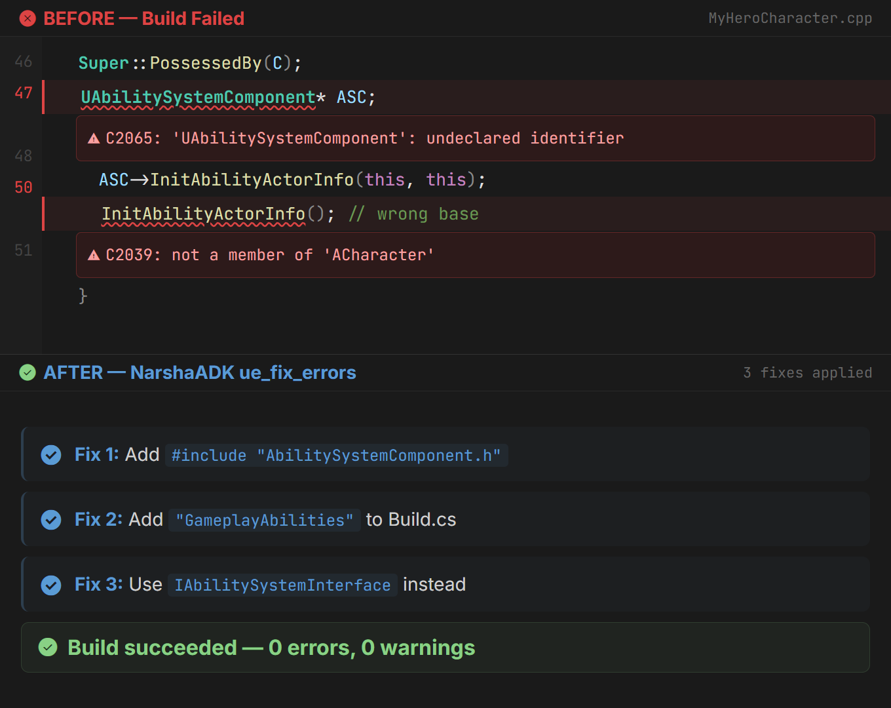
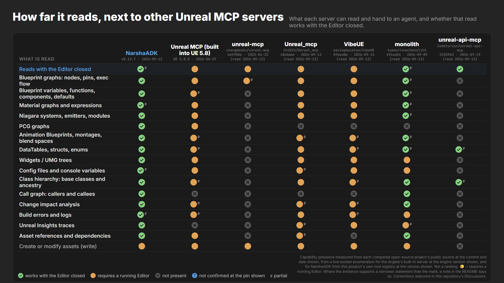
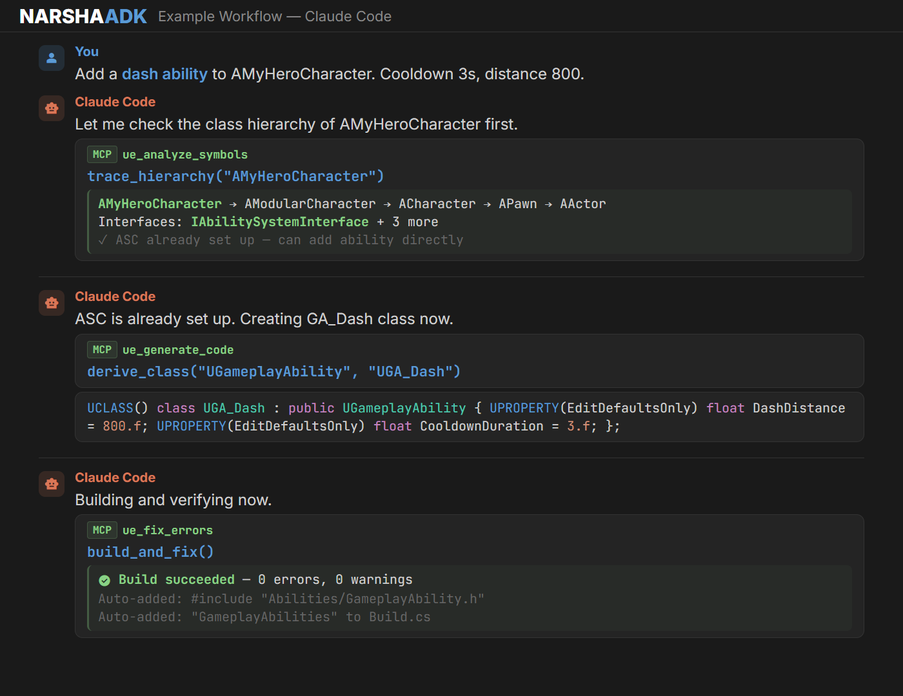

<div align="center">



# NarshaADK — AI Tools for Unreal Engine

<!-- mcp-name: io.github.Next-Stage-Inc/narshamcp -->

**NarshaMCP is the Unreal Engine MCP server inside NarshaADK, the Fab product.**

It gives MCP clients such as Claude Code and Codex evidence from your C++ source, compiler symbols (PDB)
and Blueprint `.uasset` data — read directly, instead of text-search guesses.

[**Get it on Fab**](https://www.fab.com/listings/c919281c-e2e6-4e81-8228-4e178cbc3e8d) · [**Latest release**](https://github.com/Next-Stage-Inc/narshamcp-releases/releases/latest) · [**Documentation**](https://narshaadk.ai/)

`UE 5.7` `UE 5.8` `Early Access`

</div>

---

> **Early Access** — NarshaADK is under active development. Features and workflows may change as compatibility and reliability improve.
>
> The Fab product is named **NarshaADK**. The installed plugin folder, code module, and runtime executable keep the name **NarshaMCP**.

## What you can do

- **Fix build errors** — diagnose supported build-error patterns with structured fix strategies. *"fix my build errors"* — `ue_fix_errors`
- **Search the project** — search indexed project and configured engine or plugin sources. *"find all callers of TakeDamage"* — `ue_analyze_symbols`, `ue_grep`, `ue_glob`, `ue_read`
- **Scaffold C++** — generate Unreal-aware C++ class scaffolds. *"create a GAS character class"* — `ue_generate_code`
- **Trace execution** — follow a flow across domains. *"what happens when I press Attack?"* — `ue_trace_execution`
- **Inspect assets** — read supported Blueprint, Material, Niagara and PCG data without opening the Editor — `ue_manage_blueprint`, `ue_manage_material`, `ue_manage_niagara`, `ue_manage_pcg`, `ue_search_assets`

Health and documentation: `ue_check_health`, `ue_tool_docs`. The complete list is what your client shows under `tools/list`; `ue_tool_docs` returns the documentation for any tool.

**Without NarshaADK** — reading `Content/Weapons/GA_Weapon_Fire.uasset` returns binary bytes, so the agent can only grep C++ for the name and never sees the Blueprint's parent class, variables or nodes. A build error such as `C2065: 'ULyraTeamSubsystem': undeclared identifier` turns into a guess at which header and module to add.

**With NarshaADK** — `ue_manage_blueprint` returns the parent class, the variables with their types and the node graph, read from the binary asset with the Editor closed. `ue_fix_errors` resolves the symbol in the compiler's PDB and returns the exact `#include` and module, verified against the build rather than guessed.

<div align="center">
<a href="docs/error-fix.png"></a>

<sub><b>Build-error fix.</b> <code>C2065: 'UAbilitySystemComponent': undeclared identifier</code> → add the missing <code>#include</code>, add <code>GameplayAbilities</code> to <code>Build.cs</code>, use <code>IAbilitySystemInterface</code> → build succeeds. Open full size.</sub>
</div>

## How it works

| Layer | What NarshaADK reads |
|---|---|
| **Source code analysis** | C++ parsed by a code-aware parser that understands macros such as `UPROPERTY`, `UFUNCTION` and `DOREPLIFETIME` — not plain text matching |
| **Compiler symbol index** | The same PDB debug data your debugger uses: class hierarchies, call graphs and symbol lookups |
| **Binary asset parsing** | Supported `.uasset` data without commandlets or the Editor. Operations that change assets require a running Editor |

### What it cannot do (yet)

- Cooked assets: the editor node graph is stripped at cook time, so packaged game data cannot be read.
- Blueprint data flow is surfaced as pin connections, not evaluated; execution order is what gets traced.
- Latent, async and delegate edges are approximated.
- Blueprint-only projects are not supported; a C++ project is required.
- Writing assets, spawning actors and running automation tests require a running Editor.

<!-- parsing-depth:begin -->
### How far it reads, next to other Unreal MCP servers

What each server can read and hand to an agent, and whether that read works with the Editor closed. ✅ works with the Editor closed · 🟡 requires a running Editor · ❌ not present · ? not confirmed at the pin shown · superscript p = partial.

| What is read | NarshaADK<br><sub><a href="https://github.com/Next-Stage-Inc/narshamcp-releases/releases/tag/v0.13.7">v0.13.7 · 2026-09-13</a></sub> | Unreal MCP (built into UE 5.8)<br><sub><a href="https://dev.epicgames.com/documentation/unreal-engine/unreal-mcp-in-unreal-editor">UE 5.8.0 · 2026-06-27</a></sub> | unreal-mcp<br><sub><a href="https://github.com/chongdashu/unreal-mcp/tree/4e5f00da50733190481311e254d16d137a84ef33">chongdashu/unreal-mcp@4e5f00d · 2025-04-22 (read 2026-09-13)</a></sub> | Unreal_mcp<br><sub><a href="https://github.com/ChiR24/Unreal_mcp/tree/1860a6e069d96165d5da1d1b7e4c6f5e8f8211d0">ChiR24/Unreal_mcp@1860a6e · 2026-09-13 (read 2026-09-13)</a></sub> | VibeUE<br><sub><a href="https://github.com/kevinpbuckley/VibeUE/tree/8f6ee0e3b7e0d705ec2b8c6391df2819a197a518">kevinpbuckley/VibeUE@8f6ee0e · 2026-09-13 (read 2026-09-13)</a></sub> | monolith<br><sub><a href="https://github.com/tumourlove/monolith/tree/191ea54a157687011109bae669b555be231a1745">tumourlove/monolith@191ea54 · 2026-09-09 (read 2026-09-13)</a></sub> | unreal-api-mcp<br><sub><a href="https://github.com/Codeturion/unreal-api-mcp/tree/21559e3932fc31db57cb383fd0f3172a18177934">Codeturion/unreal-api-mcp@21559e3 · 2026-07-19 (read 2026-09-13)</a></sub> |
|---|:---:|:---:|:---:|:---:|:---:|:---:|:---:|
| Reads with the Editor closed | ✅<sup>p</sup> | 🟡 | 🟡 | 🟡 | 🟡 | ✅<sup>p</sup> | ✅ |
| Blueprint graphs: nodes, pins, exec flow | ✅ | 🟡 | 🟡<sup>p</sup> | 🟡 | 🟡 | ✅<sup>p</sup> | ❌ |
| Blueprint variables, functions, components, defaults | ✅ | 🟡<sup>p</sup> | ❌ | 🟡 | 🟡 | ✅<sup>p</sup> | ❌ |
| Material graphs and expressions | ✅<sup>p</sup> | 🟡 | ❌ | 🟡 | 🟡 | ✅<sup>p</sup> | ❌ |
| Niagara systems, emitters, modules | ✅ | 🟡 | ❌ | 🟡 | 🟡 | ✅<sup>p</sup> | ❌ |
| PCG graphs | ✅ | 🟡 | ❌ | ❌ | ❌ | ❌ | ❌ |
| Animation Blueprints, montages, blend spaces | ✅ | 🟡<sup>p</sup> | ❌ | 🟡<sup>p</sup> | 🟡<sup>p</sup> | ✅<sup>p</sup> | ❌ |
| DataTables, structs, enums | ✅ | 🟡<sup>p</sup> | ❌ | 🟡 | 🟡<sup>p</sup> | ✅<sup>p</sup> | ✅<sup>p</sup> |
| Widgets / UMG trees | ✅ | 🟡 | ❌ | 🟡 | 🟡 | 🟡 | ❌ |
| Config files and console variables | ✅<sup>p</sup> | 🟡 | ❌ | 🟡<sup>p</sup> | 🟡 | 🟡 | ❌ |
| Class hierarchy: base classes and ancestry | ✅ | 🟡<sup>p</sup> | ❌ | 🟡 | 🟡<sup>p</sup> | ✅ | ✅<sup>p</sup> |
| Call graph: callers and callees | ✅ | ❌ | ❌ | ❌ | ❌ | ✅ | ❌ |
| Change impact analysis | ✅ | 🟡<sup>p</sup> | ❌ | 🟡<sup>p</sup> | 🟡<sup>p</sup> | ✅ | ❌ |
| Build errors and logs | ✅<sup>p</sup> | 🟡<sup>p</sup> | ❌ | 🟡 | 🟡<sup>p</sup> | 🟡 | ❌ |
| Unreal Insights traces | ✅ | ❌ | ❌ | 🟡<sup>p</sup> | 🟡 | 🟡<sup>p</sup> | ❌ |
| Asset references and dependencies | ✅ | 🟡 | ❌ | 🟡<sup>p</sup> | ❌ | ✅ | ❌ |
| Create or modify assets (write) | 🟡 | 🟡 | 🟡 | 🟡 | 🟡 | 🟡 | ❌ |

<div align="center">
<a href="docs/parsing-depth.png"></a>
</div>

<details>
<summary><b>Notes</b> — what each mark does and does not cover</summary>

- **Reads with the Editor closed — NarshaADK:** Binary asset parsing, the compiler symbol index, parsed config and build-log parsing all run with the Editor closed. Where a row is marked partial, that row's own note names what the mark does not cover. Writing assets, spawning actors and running automation need the Editor.
- **Reads with the Editor closed — Unreal MCP (built into UE 5.8):** In-process toolsets served by the Editor over HTTP. This column is the only one not read from a repository: it was measured by enumerating the toolsets live in one Editor at the engine version shown, and toolsets ship behind plugins, so a toolset missing from that enumeration is absent from that install rather than from the engine.
- **Reads with the Editor closed — unreal-mcp:** Python server forwards every command to a C++ Editor plugin over TCP. Its tool surface is the editor, Blueprint, Blueprint-node, project and UMG modules it registers, and the absence notes below are measured against those.
- **Reads with the Editor closed — Unreal_mcp:** Every operation is served by the Automation Bridge plugin running inside the Editor.
- **Reads with the Editor closed — VibeUE:** Extends the Editor's own MCP endpoint; no separate server.
- **Reads with the Editor closed — monolith:** Seven namespaces answer offline through monolith_query.exe from indexes the Editor built: source, project, monolith, cppreflect, network, decision and risk. Every other namespace needs the Editor. The project's API reference also names config as offline-servable; the shipped binary's own namespace list does not include it, and this table follows the code.
- **Reads with the Editor closed — unreal-api-mcp:** Serves a prebuilt engine API database; no Unreal installation required. Its tools are an API keyword search, a function-signature lookup, an include-path resolver, a class reference and a deprecation check, and the absence notes below are measured against those.
- **Blueprint graphs: nodes, pins, exec flow — unreal-mcp:** The node search handles Event nodes only, with other node types marked as not yet implemented, and it returns node identifiers rather than pins or execution flow.
- **Blueprint graphs: nodes, pins, exec flow — monolith:** The offline binary's asset-details query returns a node inventory of type, name and class; pins and execution flow come from the live Blueprint namespace.
- **Blueprint graphs: nodes, pins, exec flow — unreal-api-mcp:** Indexes the engine's Blueprint node classes from headers, not a project's Blueprint assets.
- **Blueprint variables, functions, components, defaults — Unreal MCP (built into UE 5.8):** Blueprint variables, functions and defaults are named reads; the enumeration names no read of a Blueprint's component list, because the Blueprint toolset's component units bind or list events and the units that read components belong to the actor toolset and take a placed actor.
- **Blueprint variables, functions, components, defaults — unreal-mcp:** Blueprint tools create and set (create, add component, set properties); nothing reads variables, functions or components back.
- **Blueprint variables, functions, components, defaults — monolith:** The offline binary's asset-details query returns Blueprint variables with their type, category and default value, plus a node inventory, from on-disk SQLite; functions and components are not among the fields it returns.
- **Blueprint variables, functions, components, defaults — unreal-api-mcp:** The Blueprint material in its database is the engine's own graph and node classes indexed from headers, so a class reference returns those classes' C++ members rather than a project Blueprint's variables, functions or components.
- **Material graphs and expressions — NarshaADK:** Offline node topology and graph summary; live name-based edges when the Editor runs. The material tool is Experimental.
- **Material graphs and expressions — unreal-mcp:** No material tool among the modules the server registers, nor among the README's capability categories.
- **Material graphs and expressions — monolith:** The offline asset-details query returns a material's indexed nodes and its parameters; expression connections and anything further come from the live material namespace.
- **Material graphs and expressions — unreal-api-mcp:** The engine's material classes are indexed, and its API tools return C++ API records; a material asset's expression graph is not among what any of them reads.
- **Niagara systems, emitters, modules — unreal-mcp:** No Niagara tool among the modules the server registers, nor among the README's capability categories.
- **Niagara systems, emitters, modules — monolith:** The offline asset-details query returns a system's indexed nodes, so the system and its emitters are listed with the Editor closed; module stacks, parameters and renderers come from the live Niagara namespace.
- **Niagara systems, emitters, modules — unreal-api-mcp:** Niagara is named among the indexed modules, and its API tools return its C++ API records rather than a Niagara system's emitters or modules.
- **PCG graphs — unreal-mcp:** No PCG tool among the modules the server registers, nor among the README's capability categories.
- **PCG graphs — Unreal_mcp:** The PCG tool is authoring only; its action reference lists no read-effect action.
- **PCG graphs — VibeUE:** No PCG service of its own, and the engine's PCG toolset is listed among those not enabled here; its skill document routes PCG through generic engine Python, which this table credits to no project.
- **PCG graphs — monolith:** No PCG namespace in the API reference.
- **PCG graphs — unreal-api-mcp:** No PCG tool among its API tools.
- **Animation Blueprints, montages, blend spaces — Unreal MCP (built into UE 5.8):** The enumerated skeletal-mesh and physics-asset toolsets return skeletons, bones, sockets, morph targets and physics bodies; none of them returns an Animation Blueprint graph, a montage's sections or a blend space.
- **Animation Blueprints, montages, blend spaces — unreal-mcp:** No Animation Blueprint, montage or blend space tool among the modules the server registers.
- **Animation Blueprints, montages, blend spaces — Unreal_mcp:** The animation tool's read actions cover animation-asset metadata, skeletons, bones, sockets, virtual bones, morph targets and physics assets; none of them returns an Animation Blueprint graph or a blend space.
- **Animation Blueprints, montages, blend spaces — VibeUE:** Animation Blueprint graphs and montages are read in depth; a blend space is only an asset path assigned to a player node, never read back.
- **Animation Blueprints, montages, blend spaces — monolith:** An Animation Blueprint's indexed nodes and variables come back from the offline asset-details query; a montage's sections and a blend space's samples come from the live animation namespace.
- **Animation Blueprints, montages, blend spaces — unreal-api-mcp:** The engine's animation classes are indexed, and its API tools return C++ API records; an Animation Blueprint, montage or blend space asset is not among what they read.
- **DataTables, structs, enums — Unreal MCP (built into UE 5.8):** DataTable rows and schema, and a generic object property listing; its row struct tool searches for row types, and the only enum read named in the enumeration sits inside the Niagara toolset.
- **DataTables, structs, enums — unreal-mcp:** No DataTable, struct or enum tool among the modules the server registers; the Blueprint-node module's variable tool writes a graph variable rather than reading a table.
- **DataTables, structs, enums — VibeUE:** Enums and structs are read by its own service; no DataTable service header exists at this commit, and DataTable reads are reached through the engine's own toolset co-hosted on the endpoint VibeUE extends, which this table credits to no project.
- **DataTables, structs, enums — monolith:** A user-defined struct's fields and a user-defined enum's entries reach the offline asset-details query as indexed variables; DataTable and CurveTable rows come from the live namespace.
- **DataTables, structs, enums — unreal-api-mcp:** USTRUCT and UENUM declarations parsed from C++ headers, with enum entries carried in the record and struct fields indexed as separate property records owned by the struct; no DataTable, and no Blueprint-defined struct or enum.
- **Widgets / UMG trees — unreal-mcp:** UMG tools create widget Blueprints and add text or button widgets; nothing reads a widget tree back.
- **Widgets / UMG trees — unreal-api-mcp:** Common UI is named among the indexed modules, and its API tools return those classes as C++ API records rather than a widget asset's tree.
- **Config files and console variables — NarshaADK:** Config files are read from disk across the engine and project layers; console variables are read as declarations, defaults and flags parsed from engine source joined to those layers, not as a running engine's current values.
- **Config files and console variables — unreal-mcp:** Among the modules the server registers, the project module creates an input mapping, and nothing reads INI files or console variables back.
- **Config files and console variables — Unreal_mcp:** Project and editor settings objects; INI files and console variables were not identified among the read actions.
- **Config files and console variables — unreal-api-mcp:** No INI or console-variable tool among its API tools.
- **Class hierarchy: base classes and ancestry — Unreal MCP (built into UE 5.8):** A class lookup, a Blueprint parent lookup and a subclass search; no enumerated unit returns a class's ancestry chain.
- **Class hierarchy: base classes and ancestry — unreal-mcp:** Among the modules the server registers, a parent class appears only as an argument for creating a Blueprint or a widget, never as something read back.
- **Class hierarchy: base classes and ancestry — VibeUE:** Its Blueprint service reports a Blueprint's own parent class, and the overridable function listing names the class each function comes from; no service returns the ancestry chain itself, and none reports a C++ class hierarchy.
- **Class hierarchy: base classes and ancestry — unreal-api-mcp:** One base class is captured per declaration and rendered as a single inherits line, so a class's direct parent is returned but never its ancestry, and project classes are not indexed.
- **Call graph: callers and callees — Unreal MCP (built into UE 5.8):** No symbol or call-graph tool among the enumerated toolsets.
- **Call graph: callers and callees — unreal-mcp:** Among the modules the server registers, the Blueprint-node module adds, connects and searches Blueprint graph nodes; none reports C++ callers or callees.
- **Call graph: callers and callees — Unreal_mcp:** No source or symbol domain among the parent tools.
- **Call graph: callers and callees — VibeUE:** No source or symbol service among its headers, and the bridged tools that discover modules, classes and functions introspect the Editor's Python API rather than C++ callers or callees.
- **Call graph: callers and callees — unreal-api-mcp:** No caller or callee tool among its API tools; the class reference lists a class's own members, not who calls them.
- **Change impact analysis — Unreal MCP (built into UE 5.8):** Asset dependency and referencer reads and a subclass search answer what a change to an asset or a class would reach; the enumeration carries no call graph, so the effect of changing a function is not among what it reports.
- **Change impact analysis — unreal-mcp:** No dependency, referencer or impact tool among the modules the server registers, nor among the README's capability categories.
- **Change impact analysis — Unreal_mcp:** A struct-usage search reports which assets use a given structure and a material query lists the instances of a parent, so some changes can be traced forward to what they touch; the asset domain's own reads run the other way, returning what an asset depends on, and the parent-tool table names no source or symbol domain.
- **Change impact analysis — VibeUE:** A read-only query lists every Behavior Tree node selector bound to a blackboard key, so a rename or removal can be weighed first; no service reports what a change to a class or an asset would affect.
- **Change impact analysis — unreal-api-mcp:** No change-impact tool among its API tools; the deprecation check reports whether an engine API is obsolete, not what a change would affect.
- **Build errors and logs — NarshaADK:** Build logs are detected and parsed with the Editor closed; live compiler results are read from a running Editor.
- **Build errors and logs — Unreal MCP (built into UE 5.8):** The enumerated log toolset returns Editor log entries; the enumeration names no build or compiler-results tool, so compiler messages reach an agent only as lines in that log.
- **Build errors and logs — unreal-mcp:** Among the modules the server registers, the Blueprint module returns whatever the Editor plugin replies when compiling a Blueprint; none reads a build log or the Editor log.
- **Build errors and logs — VibeUE:** A bridged tool returns Editor log entries and its own performance service reads the log back as part of a run summary; its build path is a shell script rather than a tool, so C++ compiler output is not among what it reads.
- **Build errors and logs — unreal-api-mcp:** No build-log or Editor-log tool among its API tools, which query a prebuilt database rather than a running build.
- **Unreal Insights traces — Unreal MCP (built into UE 5.8):** No profiling toolset among the enumerated tools.
- **Unreal Insights traces — unreal-mcp:** No profiling or trace tool among the modules the server registers, nor among the README's capability categories.
- **Unreal Insights traces — Unreal_mcp:** Trace capture and session control, plus a probe of a trace on disk that reports its size, times and leading bytes and labels itself as file metadata and a header probe; the trace contents are not decoded.
- **Unreal Insights traces — monolith:** Profiling brackets and trace channels inside play sessions; a recorded trace file is not among what it reads.
- **Unreal Insights traces — unreal-api-mcp:** No profiling or trace tool among its API tools.
- **Asset references and dependencies — unreal-mcp:** No asset-reference or dependency tool among the modules the server registers; the Blueprint-node module's reference tools write self and component references into a graph.
- **Asset references and dependencies — Unreal_mcp:** An asset's dependency list and its recursive dependency graph read forward; no action in the reference returns the assets that reference a given asset.
- **Asset references and dependencies — VibeUE:** Its own asset service covers import, export, delete and selection, and referencers surface only as the refusal payload of an attempted delete; the reference and dependency queries are reached through the engine's own toolset co-hosted on the endpoint VibeUE extends, which this table credits to no project.
- **Asset references and dependencies — unreal-api-mcp:** Its database holds C++ API records parsed from engine headers, and its API tools return those records; project assets and their references are not among them.
- **Create or modify assets (write) — unreal-api-mcp:** Read-only API reference server.
- **Tool maturity — NarshaADK:** Tool maturity at this version: symbol analysis is Production; the Blueprint, config, build-error, asset-search and Sequencer-structure tools are Beta; the Material, Niagara, PCG and Insights tools are Experimental, as are the Sequencer keyframe, playback and track tools; the Widget, Animation and asset-diff tools have no maturity rating yet.

</details>

Capability presence measured from each compared open-source project's public source at the commit and date shown, from a live toolset enumeration for the engine's built-in server at the engine version shown, and for NarshaADK from this product's own tool registry at the version shown. Not a ranking. 🟡 = requires a running Editor. Where the evidence supports a narrower statement than the mark, a note in the README says so. Corrections welcome in this repository's Discussions.
<!-- parsing-depth:end -->

<div align="center">
<a href="docs/workflow.png"></a>

<sub><b>A request, end to end.</b> Check the class hierarchy with <code>ue_analyze_symbols</code> → derive a <code>UGameplayAbility</code> subclass with <code>ue_generate_code</code> → build and verify with <code>ue_fix_errors</code>. Open full size.</sub>
</div>

## Supported versions

| Unreal Engine | Plugin package |
|---|---|
| UE 5.8 | `NarshaMCP-v<version>-UE5.8-Release-RustMCP.zip` |
| UE 5.7 | `NarshaMCP-v<version>-UE5.7-Release-RustMCP.zip` |

## Requirements

- An Unreal Engine 5.7 or 5.8 C++ project (Blueprint-only projects are not supported yet)
- Visual Studio 2022 with the Unreal Engine C++ build tools
- An MCP client — tested with Claude Code and Codex. AI clients are separate products and may require their own subscription.
- No separate Python or Node.js runtime — NarshaADK ships a self-contained runtime

## Install

**From Fab** — install NarshaADK from the [Fab listing](https://www.fab.com/listings/c919281c-e2e6-4e81-8228-4e178cbc3e8d) and enable the NarshaMCP plugin in a C++ project.

**From GitHub Releases**

1. Download the ZIP for your engine version from the [latest release](https://github.com/Next-Stage-Inc/narshamcp-releases/releases/latest).
2. Extract the ZIP into `YourProject/Plugins/`. The ZIP already contains the `NarshaMCP` folder, so the plugin lands in `YourProject/Plugins/NarshaMCP/`. When upgrading, remove the previous `Plugins/NarshaMCP/` folder first, and keep a copy if you may want to go back.
3. Build the C++ project once. The first build runs local setup and creates the project MCP configuration.
4. Open the local dashboard's AI Clients section and confirm the Claude Code or Codex connection.

## Connect your MCP client

The first build writes the project's MCP configuration for you. If you configure a client by hand, point it at the runtime that ships inside the plugin:

```json
{
  "mcpServers": {
    "narshamcp": {
      "command": "<Project>/Plugins/NarshaMCP/Source/ThirdParty/bin/narshamcp.exe",
      "args": ["connect", "--project-path", "<Project>"],
      "env": { "RUST_LOG": "error" }
    }
  }
}
```

- Claude Code: `claude mcp add narshamcp -- "<Project>/Plugins/NarshaMCP/Source/ThirdParty/bin/narshamcp.exe" connect --project-path "<Project>"`
- Codex: the same `command` and `args` under `[mcp_servers.narshamcp]` in your Codex `config.toml`.
- Clients that launch the server as a direct process (for example Cursor) use `--stdio` instead of `connect`.

## Package contents

Each stable release attaches exactly three files:

- `NarshaMCP-v<version>-UE5.7-Release-RustMCP.zip` and `NarshaMCP-v<version>-UE5.8-Release-RustMCP.zip` — the same plugin ZIPs submitted to Fab. They contain the Unreal C++ plugin project files needed to build the plugin, plus the runtime.
- `narshamcp-windows-x64.exe` — the standalone Windows runtime, byte-identical to the runtime inside the ZIPs.

Each release's notes list the SHA-256 digest of every file. The runtime's implementation and build infrastructure are not included.

The v0.13.7 runtime is not code-signed; code signing begins with v0.14.x. Nightly builds are prereleases for early validation. Their plugin ZIPs use the `Develop` label so they cannot be mistaken for a Fab package; for production work, use the latest stable release.

## Third-party software

Third-party software notices ship inside the runtime: run `narshamcp --licenses` (or `narshamcp --licenses-json`).

## License

NarshaADK is licensed under the [Fab End User License Agreement](https://www.fab.com/eula) (the "Fab Standard License"). Copies downloaded from this repository are granted the same terms directly by Next Stage Inc.: the Personal tier applies at no charge below the Fab revenue threshold, and above it a Professional license acquired through the [Fab listing](https://www.fab.com/listings/c919281c-e2e6-4e81-8228-4e178cbc3e8d) is required. The plugin packages attached to stable releases are the same packages submitted to Fab. See [LICENSE.md](LICENSE.md).

## Support

Documentation and examples are at [narshaadk.ai](https://narshaadk.ai/). To ask questions or report issues, use the support channel on the [Fab listing](https://www.fab.com/listings/c919281c-e2e6-4e81-8228-4e178cbc3e8d).

NarshaADK is built and maintained by Next Stage Inc.

**Keywords**: Unreal Engine MCP server, UE5 MCP, Claude Code Unreal Engine, Codex Unreal Engine, PDB symbol search, Blueprint parser, .uasset, Gameplay Ability System, NarshaADK, NarshaMCP
